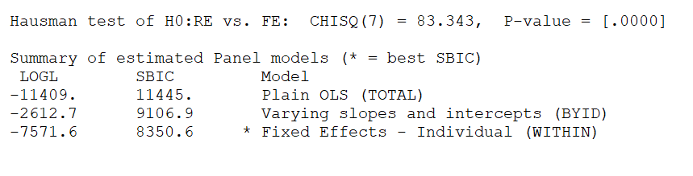

```{r setup, include=FALSE}
knitr::opts_chunk$set(echo = TRUE, comment = NA, dpi = 300)
# Load package & data
library(ggplot2)
theme_set(ggthemes::theme_economist())
library(knitr)
#library(kableExtra)
library(readr)
library(dplyr)
phillips <- read_csv("final_data/final.csv")
```

# Introduction 

En 1958, dans son article *The Relation between Unemployment and the Rate of Change of Money Wage Rates in the United Kingdom*, l'économiste néo-zélandas William Phillips fait une observation de la relation négative entre le taux de chômage et l'inflation. Il explique cette relation par le fait qu'au-delà d'un certain niveau de chômage, les salariés ne sont plus en position de force pour exiger une hausse de salaire ; le partage des gains de productivité s'effectue alors en faveur de l'entreprise. Donc, les salariés ont plus de pouvoir quand il y a un faible taux de chômage.  
La relation que Phillips décrit nourrit ainsi la pensée des économistes de l'époque et des travaux similaires ont été menés dans d'autres pays pour vérifier la fiabilité de sa prédiction.  
La relation décrite par Phillips est ensuite théorisée par la courbe de Phillips qui représente sur un graphique le lien entre le taux de chômage et l'inflation. 

La courbe de Phillips va donner une grande impulsion au modèle keynésien qui peinait à établir une relation entre les variables réelles et les variables nominales. Incluant donc dans son modèle la courbe de Phillips et la loi d'Okun, le modèle keynésien a grandi en influence et imposait un consensus dans les années 1950.   

La relation décrite par la courbe de Phillips a notamment été contestée par des économistes comme Milton Friedman et Robert Lucas.  Pour Friedman, la courbe de Phillips est valable à court terme car à court terme les anticipations des agents sont fausses du fait qu'ils sont victimes d'illusions. Ainsi pour Friedman, en réalité la courbe de Phillips est verticale car il existe un chômage naturel sur le long terme et le taux de chômage est égal à ce taux naturel.  

# Présentation de la base de données et exploration des variables d'intérêt.  

Pour répondre aux questions que nous nous sommes posées dans la problématique, nous avons pensé à collecter des données sur les grandeurs macroéconomiques évoqués dans la théorie économique. Nous avons donc choisi les variables suivantes :   

- Le taux de chômage (UNEMPLOYMENT)
- Croissance du PIB (GDPGROWTH)
- Les dépenses publiques (SPENDING) 
- Le taux d'inflation (INFLATION) 
- Le stock des migrants (MIGRATION)
- La croissance de la population (POPGROWTH)
- Pourcentage de la population urbaine (URBANPOP)
- Le pourcentage de la population ayant accès à l'électricité (ELECTRICITY)  

Lors du pré-traitement des données, nous avons remarqué qu'il existait beaucoup de données manquantes pour la variable *stock de migrants (MIGRATION)*, il nous a donc semblé pertinent de retirer cette variable du modèle car les techniques d'imputation multiple que nous avons utilisées pour imputer les données manquantes remplaceraient les données par des données biaisées qui réduisent la variance que nous cherchons à expliquer.  
Les détails sur le pré-traitement des données ainsi que les scripts R se trouvent dans les annexes de ce document.   

Nous n'avons pas parmi nos variables des variables qui ne varient qu'avec les individus, toutes les variables varient en même temps avec les individus et avec le temps. 

# Analyses statistiques des variables et visualisations 

Les données sont cylindrées, ce qui signifie que pour chaque avons pour chaque année 182 observations. La période sur laquelle nous travaillons est de 20 ans, de l'année 2000 et 2019.  

Nous voulons trouver une stratégie pour représenter l'évolution des variables pour tous les pays pendant 20 ans. Nous calculons donc la valeur moyenne de chaque variable pour tous les pays puis nous les représentons sur un graphique. 

```{r echo=FALSE, fig.height=8, fig.width=8}
summaries <- phillips %>%
  select(- c(COUNTRY, ID, MIGRATION)) %>%
  group_by(YEAR) %>%
  summarise_all(mean)

layout(matrix(1:9, ncol = 3, byrow = TRUE)) 
for (column in colnames(summaries[,2:10])) {
  plot(x=2000:2019, y= summaries[[column]], main = column, 
       xlab = "Années", ylab = column, type = "l")
}
```

Pour chacune des variables nous observons des tendances différentes. Le PIB, le PIB par tête, les dépenses publiques, la part de la population urbaine et le pourcentage de la population ayant accès à l'électricité ont augmenté. Il n'y a pas de saisonnalité pour ces variables.  
De l'autre côté, la croissance du PIB, le taux d'inflation, la croissance de la population puis le taux de chômage ont des tendances plus variables.  
La tendance du taux de chômage semble suivre celle du taux de croissance du PIB. Le taux d'inflation de son côté fluctue beaucoup plus sur ces périodes de 20 ans.  


Nous pouvons faire de même pour représenter l'évolution de la variance pour chaque pays durant les 20 années. 

```{r echo=FALSE, fig.height=8, fig.width=8}
summaries <- phillips %>%
  select(- c(COUNTRY, ID, MIGRATION)) %>%
  group_by(YEAR) %>%
  summarise_all(var)

layout(matrix(1:9, ncol = 3, byrow = TRUE)) 
for (column in colnames(summaries[,2:10])) {
  plot(x= 2000:2019, y = summaries[[column]], main = column, 
       xlab = "Années", ylab = column, type = "l")
}
```


Nous allons faire un dernier graphique qui représente un nuage de point du taux de chômage avec toutes les moyennes des variables pour les données.  

```{r echo=FALSE, fig.height=8, fig.width=8, message=FALSE, warning=FALSE}
summaries <- phillips %>%
  select(- c(COUNTRY, ID, MIGRATION)) %>%
  group_by(YEAR) %>%
  summarise_all(mean)

layout(matrix(1:9, ncol = 3, byrow = TRUE)) 
for (column in colnames(summaries[,2:10])) {
  res_estim <- lm(as.formula(paste("UNEMPLOYMENT", "~", column)), data = summaries)$coefficients
  plot(y= summaries$UNEMPLOYMENT, x = summaries[[column]], main = paste("UNEMPLOYMENT vs.", column), 
       ylab = "UNEMPLOYMENT", xlab = column, type = "p")
  if (column != "UNEMPLOYMENT") {
    abline(a = res_estim[1], b = res_estim[2], col = "red")
  }
}
```

Sur ces graphiques nous observons qu'il y a des relations à la fois positives et négatives entre le taux de chômage et les variables endogènes.  

Par exemple le PIB par habitant, les dépenses publiques, la part de la population urbaine ont des impacts négatifs sur le taux de chômage.  

# Tests de spécification du modèle  

## Note sur les méthodes d'estimation sur des données panel 

Dans le cadre des données de panel, nous possédons un échantillon comportant des informations sur un ensemble d’individus indicés par $i = 1,…, N$ que l’on suppose présents pendant toute la période d’étude (on parle alors d’échantillon cylindré (balanced) sinon non cylindré (no balanced)). Les dates auxquelles les
données sont observées sont indicées par $t = 1, ..., T$.  
Pour chaque individu, on peut écrire :

$$y_{it} = X_{it}b + u_{it}$$


où $u_{it}$ représente le terme d'erreur. Selon les propriétés de la distribution de $u$ nous sommes amenés à choisir différents estimateurs.  

## Le modèle linéaire

Les différents modèles des données de panel se distinguent par les hypothèses faites sur le terme d'erreur. Par exemple si nous supposons que le terme d'erreur vérifie toutes les hypothèses standard des moindres carrés ordinaires (OLS) alors nous allons construire un modèle linéaire que nous estimons par les OLS.   

## Les modèles à effets individuels 

Les hypothèses faites pour le modèle à erreur simple sont difficiles à soutenir dans la réalité car peu de modèles peuvent résumer la totalité de l’hétérogénéité des comportements des individus au moyen des seules variables explicatives. On parle d’hétérogénéité inobservée :  

Il existe deux modèles principaux qui prennent en compte l’hétérogénéité des individus :  

- Le modèle à erreur composée qui suppose que l’effet individuel est sans corrélation avec les variables explicatives. On parle de modèle à effet non corrélé. 
- Le modèle à effet fixe qui suppose que l’hétérogénéité est corrélée avec les variables explicatives. On parle de modèle à effet corrélé. 

Le modèle à effet fixe est considéré comme le plus pertinent.  

## Test pour la spécification du modèle avec TSP 

Avant donc de commencer à estimer les paramètres du modèle il importe de tester avec TSP pour savoir quelle spécification du modèle conviendrait le mieux.  

 

# Détection de l'existence d'une multicolinéarité entre les variables. 

```{r echo=FALSE}
phillips %>%
  select(-c(ID, GDPUSD, URBANPOP, YEAR, COUNTRY)) %>%
  lm(UNEMPLOYMENT~., data = .) %>%
  car::vif() %>%
  kable(col.names = "Valeur VIF")
```


# Estimations de tous les modèles 

Nous estimerons au total 9 modèles selon les spécifications suivantes : 

## Estimation par OLS 

## Estimation deux effets fixes 

## Estimation sans effet temps WITHIN

## Estimation effet temps ONLY

## Estimations effets aléatoires 

## Estimations effets aléatoires sans effets temps 

## Estimation résidus autorégressif ordre 1 

## Estimation BETWEEN groupe 

## Estimation BETWEEN période  


# Tests 


